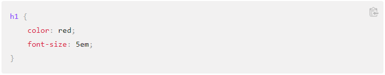

# Read: 05 - Design web pages with CSS

___What is CSS?___

CSS stands for Cascading Style Sheets. While HTML can change some visual appearance of a site, CSS can transform the aesthetic appeal. Anything that has to do with color, size and borders can be tweaked using CSS.

___Syntax___

___New Vocab___

Document - A text file structured primary by HTML.

Presenting - Converting a document into a form usable by an audience.

___How to Add CSS___

The three ways of inserting a style sheet are:

* External CSS.
    * External styles are defined within the link element, inside the head section of an HTML page
    * Can be written in any text editor and must be saved with a .css extension
    * Shouldn't contain any HTML tags

* Internal CSS.
    * An internal style sheet may be used if one single HTML page has a unique style
    * The internal style is defined inside the style element, inside the head section

* Inline CSS.
    * Inline may be used to apply unique style for a single element

CSS Priority:

1. Inline style (inside an HTML element)
2. External and internal style sheets (in the head section)
3. Browser default

### Sources: 

[https://developer.mozilla.org/en-US/docs/Learn/CSS/First_steps/What_is_CSS](https://developer.mozilla.org/en-US/docs/Learn/CSS/First_steps/What_is_CSS) 

[https://www.w3schools.com/css/css_howto.asp](https://www.w3schools.com/css/css_howto.asp)

[https://www.w3schools.com/cssref/pr_text_color.asp](https://www.w3schools.com/cssref/pr_text_color.asp)

[https://developer.mozilla.org/en-US/docs/Web/CSS/Reference](https://developer.mozilla.org/en-US/docs/Web/CSS/Reference)

[https://meyerweb.com/eric/tools/css/reset/](https://meyerweb.com/eric/tools/css/reset/)

[https://developer.mozilla.org/en-US/docs/Web/HTML/Element](https://developer.mozilla.org/en-US/docs/Web/HTML/Element)

