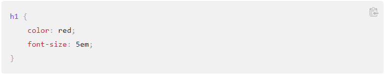

# Read: 07 - Programming with JavaScript

## Control Flow

* The order in which the computer executes statesments
* Code runs from the first line to the last line unless interupted by conditionals or loops

### If Statment Syntax

### Function Syntax

* JS functions are defined with the function keyword, followed by a name and parentheses.
    * function eatFood()
* Parentheses may inlcude parameter names seperated by commas.
    * (param1, param2, ...)
*Function arguments are the values received by the function when invoked.
* When JS reaches a return statement, the function willstop executing.
* After defining code, it can be reused many times.
* The () Operator incokes the Function
* Variables declared withing a JS function, become local.

### JavaScript Operators

* The assignment operator (=) assigns a value to a variable.
* The addition operator (+) adds numbers:
* The multiplication operator (*) multiplies numbers.
* Arithmetic operators perform calculations.
* Assignment operators assign values to JS variables.
* Adding a number and a string will return a string.

## Sources:

[https://developer.mozilla.org/en-US/docs/Glossary/Control_flow](https://developer.mozilla.org/en-US/docs/Glossary/Control_flow)

[https://www.w3schools.com/js/js_functions.asp](https://www.w3schools.com/js/js_functions.asp)

[https://www.w3schools.com/js/js_operators.asp](https://www.w3schools.com/js/js_operators.asp)

[https://developer.mozilla.org/en-US/docs/Web/JavaScript/Guide/Expressions_and_Operators](https://developer.mozilla.org/en-US/docs/Web/JavaScript/Guide/Expressions_and_Operators)

[https://developer.mozilla.org/en-US/docs/Web/JavaScript/Guide/Functions](https://developer.mozilla.org/en-US/docs/Web/JavaScript/Guide/Functions)

