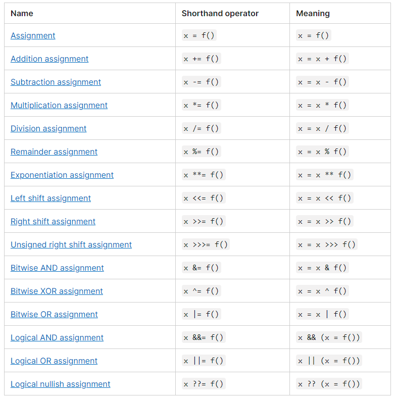
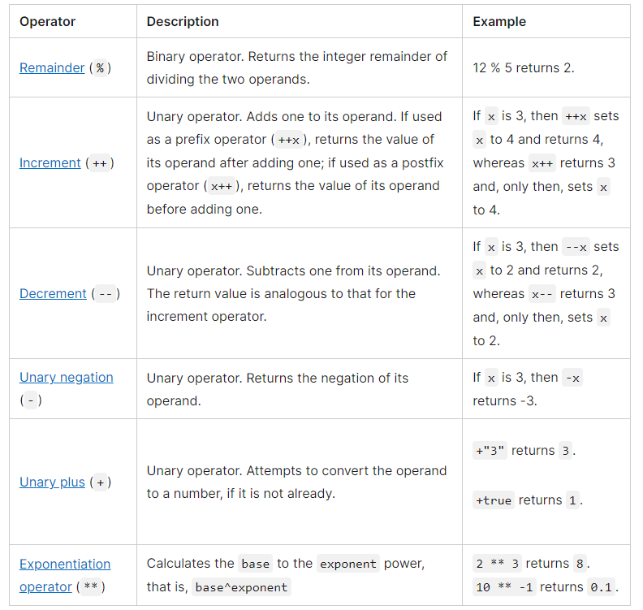
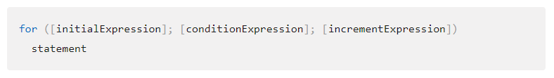
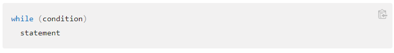

# Read: 08 - Operators and Loops

## Expressions and Operators

* An experssion is a valid unit of code that resolves to a value

In __x = 12__ the = operator assigns the value to the variable x. The expression evaluates to 12.

## Operators include:
* __String operators__
* __Conditional (ternary) operator__
* __Comma operator__
* __Unary operators__
* __Relational operators__

* ___Assignment operators___
    * Assignment operator assigns a value to its left operand based.
    * If an expression evaluates to an object, then the left-hand side of an assignment expression may make assignments to properties of that expression.
    * Deconstructing assignments extract data from  arrays or objects.
    * Evaluations are made from left to right.
    * Avoid assignment chains like let z = y = x = f();

    

* ___Comparison operators___
    * Compares its operands and returns a logical value based on whether the comparison is true.

    

* ___Arithmetic operators___
    * An arithmetic operator takes numerical values (either literals or variables) as their operands and returns a single numerical value

    

* ___Bitwise operators___
    * A bitwise operator treats their operands as a set of 32 bits (zeros and ones

* ___Logical operators___
    * Logical operators are typically used with Boolean (logical) values
    * false && anything is short-circuit evaluated to false.
    * true || anything is short-circuit evaluated to true.

* ___BigInt operators___

    * Most operators that can be used between numbers can be used between BigInt

## Loops 

* For loops repeat until conditions evaluates to false.
    

* While statement will as long as condition is true.
    

Sources: 

[https://developer.mozilla.org/en-US/docs/Web/JavaScript/Guide/Expressions_and_Operators](https://developer.mozilla.org/en-US/docs/Web/JavaScript/Guide/Expressions_and_Operators)

[https://developer.mozilla.org/en-US/docs/Web/JavaScript/Guide/Loops_and_iteration](https://developer.mozilla.org/en-US/docs/Web/JavaScript/Guide/Loops_and_iteration)

